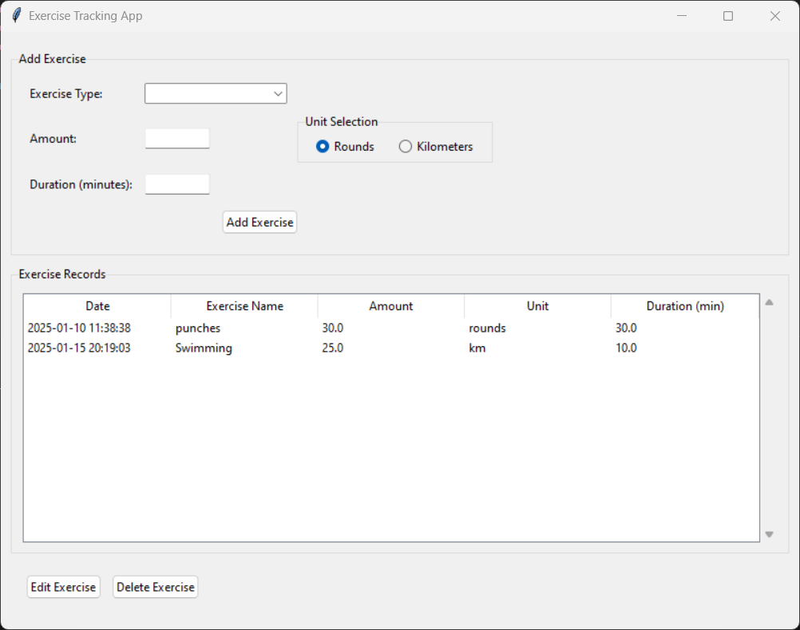

Exercise Tracker application:

```markdown
# Exercise Tracker Application

The Exercise Tracker is a Python-based desktop application that helps users log and manage their exercise routines. It features a user-friendly interface built with `Tkinter` for tracking different types of exercises, their durations, and associated details.

## Features

- Add predefined exercise types (e.g., Running, Swimming, Cycling).
- Create custom exercise types with personalized names.
- Track exercise details including:
  - Amount (e.g., kilometers or rounds)
  - Duration (in minutes)
  - Date and time of entry
- View, edit, or delete exercise records.
- Automatically save and load exercise data in JSON format.

## Technologies Used

- **Language**: Python
- **GUI Library**: Tkinter
- **Data Storage**: JSON files for persistent data.

## Setup and Installation

### Prerequisites

1. **Python**: Ensure Python 3.x is installed on your system. You can download it from [python.org](https://www.python.org/).
2. **pip**: Python's package installer (usually included with Python 3.x).

### Steps

1. **Clone the Repository**:
   ```bash
   git clone https://github.com/yourusername/exercise-tracker.git
   cd exercise-tracker
   ```

2. **Install Dependencies**:
   The app does not require external Python packages since it uses standard libraries (`Tkinter`, `datetime`, `json`, etc.). Simply ensure Python is set up correctly.

3. **Run the Application**:
   Execute the following command to launch the app:
   ```bash
   python app.py
   ```

4. **Optional**: To package the application into an executable:
   - Install `PyInstaller`:
     ```bash
     pip install pyinstaller
     ```
   - Create an executable:
     ```bash
     pyinstaller --onefile app.py
     ```

## How to Use

1. **Add an Exercise**:
   - Select an exercise type from the dropdown menu or create a custom exercise by selecting "Custom."
   - Enter the amount, unit (rounds or kilometers), and duration (optional).
   - Click **Add Exercise** to save the entry.

2. **View Records**:
   - The list of all recorded exercises is displayed in a table format.
   - Use the scrollbar to navigate through entries.

3. **Edit Records**:
   - Select an exercise from the list and click **Edit Exercise**.
   - Modify the details in the pop-up window and click **Save**.

4. **Delete Records**:
   - Select an exercise from the list and click **Delete Exercise**.
   - Confirm the deletion in the pop-up dialog.

5. **Persistent Data**:
   - The app saves all exercise records in a `exercise_data.json` file located in the same directory as `app.py`.
   - Upon restarting, the app automatically loads the saved data.

## File Structure

```plaintext
exercise-tracker/
├── exercise_tracker.py                 # Main application file
├── exercise_data.json     # Data file for saved exercise records
└── README.md              # Documentation (this file)
```

## Screenshots



## Contributing

Contributions are welcome! If you have suggestions or want to add new features:
1. Fork this repository.
2. Create a new branch for your feature or fix.
3. Submit a pull request with a detailed explanation.

## Contact

Feel free to reach out with feedback or inquiries:

- **Email**: [e.bryandze@gmail.com]
- **X** : [https://x.com/dze_bryan]
- **LinkedIn**: [www.linkedin.com/in/dzebryan237]
- **GitHub**: [https://github.com/G-Bryan237]

---
